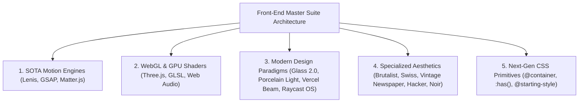

# 🎨 Master Design System, Motion Engineering & UI Patterns Guide

> A comprehensive, top-tier educational handbook for modern front-end engineers, UI/UX designers, and systems architects. Covers zero-dependency front-end design, SOTA motion engines (Lenis, GSAP), 2D rigid-body physics (Matter.js), WebGL GLSL shaders, Glassmorphism 2.0, next-gen CSS primitives, and modular component design patterns across all 35+ portfolio templates.

---

## 🏛️ 1. Architecture & Design Philosophy

This collection was engineered with a strict **Zero Build Step, Zero Dependency Overhead** philosophy. Every template and component file is a self-contained, standalone single-file HTML/CSS/JS system that renders natively in any browser with 60fps performance.



---

## 🖼️ 2. Visual Master Catalogue & Design Gallery

Below is an exhaustive visual showcase of all template aesthetics in this collection:

### 1. SOTA Lenis Inertia & GSAP Kinetic Portfolio

* **Key Features**: Lenis smooth momentum scroll engine (`@studio-freight/lenis`), GSAP ScrollTrigger pinned horizontal scroll, kinetic split typography.
* **Primary Template**: [`Master 05 — Lenis Smooth Inertia & GSAP Kinetic.html`](file:///home/anmol/Projects/HTML%20Web%20Designs%20for%20portfolio%20website/Master%2005%20%E2%80%94%20Lenis%20Smooth%20Inertia%20&%20GSAP%20Kinetic.html)

---

### 2. Matter.js Physics & Vercel Border Beam

* **Key Features**: Interactive Matter.js 2D rigid-body gravity canvas for skills & tech badges, Vercel-style rotating conic laser border beams.
* **Primary Template**: [`Master 06 — Matter.js Physics & Vercel Border Beam.html`](file:///home/anmol/Projects/HTML%20Web%20Designs%20for%20portfolio%20website/Master%2006%20%E2%80%94%20Matter.js%20Physics%20&%20Vercel%20Border%20Beam.html)

---

### 3. Spatial Glassmorphism 2.0 & 3D Bento

* **Key Features**: Multi-layered frosted glass panels (`backdrop-filter: blur(20px)`), specular top border glare, 3D mouse perspective card tilt math, Three.js 3D wireframe canvas.
* **Primary Template**: [`Master 01 — Modern Bento Spatial 3D.html`](file:///home/anmol/Projects/HTML%20Web%20Designs%20for%20portfolio%20website/Master%2001%20%E2%80%94%20Modern%20Bento%20Spatial%203D.html) & [`Spatial Glass 3D Bento.html`](file:///home/anmol/Projects/HTML%20Web%20Designs%20for%20portfolio%20website/Spatial%20Glass%203D%20Bento.html)

---

### 4. Raycast Command OS & Quick Action Dock

* **Key Features**: Keyboard-driven Cmd+K modal dialog, macOS floating glass quick-action dock, status pills, and hotkey listeners.
* **Primary Template**: [`Master — Raycast Command OS.html`](file:///home/anmol/Projects/HTML%20Web%20Designs%20for%20portfolio%20website/Master%20%E2%80%94%20Raycast%20Command%20OS.html) & [`Component — Raycast Floating Dock & Quick Actions.html`](file:///home/anmol/Projects/HTML%20Web%20Designs%20for%20portfolio%20website/Component%20%E2%80%94%20Raycast%20Floating%20Dock%20&%20Quick%20Actions.html)

---

### 5. Pristine Porcelain Enterprise Light Mode

* **Key Features**: Crisp white (`#ffffff` / `#f8fafc`) backdrop with radial dot grid pattern, deep royal blue (`#2563eb`) accents, and elevated multi-shadow cards.
* **Primary Template**: [`Enterprise Kinetic Light.html`](file:///home/anmol/Projects/HTML%20Web%20Designs%20for%20portfolio%20website/Enterprise%20Kinetic%20Light.html) & [`Master 02 — Kinetic Cmd-K Enterprise.html`](file:///home/anmol/Projects/HTML%20Web%20Designs%20for%20portfolio%20website/Master%2002%20%E2%80%94%20Kinetic%20Cmd-K%20Enterprise.html)

---

### 6. Stripe Press Luxury Mesh Gradient

* **Key Features**: Dynamic HTML5 multi-color mesh gradient canvas, fluid particle movement, high-contrast dark typography.
* **Primary Template**: [`Master — Stripe Enterprise Glass.html`](file:///home/anmol/Projects/HTML%20Web%20Designs%20for%20portfolio%20website/Master%20%E2%80%94%20Stripe%20Enterprise%20Glass.html) & [`Component — Stripe Mesh Gradient Canvas.html`](file:///home/anmol/Projects/HTML%20Web%20Designs%20for%20portfolio%20website/Component%20%E2%80%94%20Stripe%20Mesh%20Gradient%20Canvas.html)

---

### 7. CAD Technical Blueprint Grid

* **Key Features**: Technical grid overlays, coordinate crosshairs, architectural dimension lines, and monospace telemetry badges.
* **Primary Template**: [`Technial Grid.html`](file:///home/anmol/Projects/HTML%20Web%20Designs%20for%20portfolio%20website/Technial%20Grid.html)

---

### 8. Neo-Brutalist Hard Offset Physics

* **Key Features**: High-saturation primary colors, 3px solid black outlines (`border: 3px solid #000`), hard offset drop shadows (`box-shadow: 4px 4px 0px #000`).
* **Primary Template**: [`Neo Brutalist.html`](file:///home/anmol/Projects/HTML%20Web%20Designs%20for%20portfolio%20website/Neo%20Brutalist.html)

---

### 9. Elegant Brutalist Monolithic Grid

* **Key Features**: High contrast monochrome black and white palette, bold architectural serif headers, stark structural grid lines, raw form layout.
* **Primary Template**: [`Elegant Brutalist.html`](file:///home/anmol/Projects/HTML%20Web%20Designs%20for%20portfolio%20website/Elegant%20Brutalist.html)

---

### 10. Vintage Editorial Newspaper Print

* **Key Features**: Cream paper texture background (`#fbf9f5`), multi-column CSS newspaper layout (`column-count: 3`), drop caps, decorative editorial section dividers, classic serif typography.
* **Primary Template**: [`Vintage Newspaper.html`](file:///home/anmol/Projects/HTML%20Web%20Designs%20for%20portfolio%20website/Vintage%20Newspaper.html)

---

### 11. Swiss International Typographic Style

* **Key Features**: Ultra-clean white canvas, asymmetric grid alignment, bold Helvetica sans-serif typography, red accent lines, precision layout spacing.
* **Primary Template**: [`Swiss Minimalist.html`](file:///home/anmol/Projects/HTML%20Web%20Designs%20for%20portfolio%20website/Swiss%20Minimalist.html)

---

### 12. Hacker Command-Line Terminal

* **Key Features**: Pure pitch black canvas (`#000000`), neon green matrix text (`#00ff66`), monospace ASCII art headers, command-line prompt input listeners, system status telemetry.
* **Primary Template**: [`Hacker.html`](file:///home/anmol/Projects/HTML%20Web%20Designs%20for%20portfolio%20website/Hacker.html)

---

### 13. Cinematic Spotlight & Filmic Luxury

* **Key Features**: Deep dark luxury canvas, interactive mouse-following radial cursor spotlight reveal, filmic blur overlays, gold/amber typography.
* **Primary Template**: [`Cinematic Spotlight.html`](file:///home/anmol/Projects/HTML%20Web%20Designs%20for%20portfolio%20website/Cinematic%20Spotlight.html) & [`Cinematic Noir.html`](file:///home/anmol/Projects/HTML%20Web%20Designs%20for%20portfolio%20website/Cinematic%20Noir.html)

---

## 🌊 3. State-of-the-Art (SOTA) Motion Engineering

### 1. Lenis Smooth Scroll Engine (`@studio-freight/lenis`)
Lenis recalculates scroll events with inertia physics to create smooth 60fps scrolling, synchronized with GSAP ScrollTrigger ticker:

```javascript
const lenis = new Lenis({
    duration: 1.2,
    easing: (t) => Math.min(1, 1.001 - Math.pow(2, -10 * t)),
    smoothWheel: true
});

gsap.registerPlugin(ScrollTrigger);

lenis.on('scroll', ScrollTrigger.update);
gsap.ticker.add((time) => {
    lenis.raf(time * 1000);
});
gsap.ticker.lagSmoothing(0);
```

### 2. GSAP ScrollTrigger Horizontal Pinning
Pins a section in place while translating child elements horizontally based on scroll progress:

```javascript
const horizontalSection = document.getElementById("horizontal");
gsap.to(horizontalSection, {
    x: () => -(horizontalSection.scrollWidth - window.innerWidth),
    ease: "none",
    scrollTrigger: {
        trigger: "#projects",
        start: "top top",
        end: () => "+=" + (horizontalSection.scrollWidth - window.innerWidth),
        pin: true,
        scrub: 1,
        invalidateOnRefresh: true
    }
});
ScrollTrigger.refresh();
```

### 3. Matter.js 2D Rigid-Body Physics Engine
Creates interactive gravity containers where tech skill pills bounce and react to cursor dragging:

```javascript
const { Engine, Render, Runner, Bodies, Composite, Mouse, MouseConstraint } = Matter;
const engine = Engine.create();
engine.world.gravity.y = 0.8;

const pill = Bodies.rectangle(x, y, 110, 36, {
    chamfer: { radius: 18 },
    restitution: 0.7,
    friction: 0.1,
    render: { fillStyle: '#06b6d4' }
});
Composite.add(engine.world, pill);
```

### 4. Vercel Conic Border Beam (`@property`)
Uses pure CSS `@property --angle` to rotate a laser gradient border around cards infinitely:

```css
@property --angle {
    syntax: '<angle>';
    initial-value: 0deg;
    inherits: false;
}

.beam-card::before {
    content: '';
    position: absolute;
    inset: -2px;
    border-radius: 22px;
    padding: 2px;
    background: conic-gradient(from var(--angle), transparent 70%, #06b6d4, #ec4899, transparent);
    -webkit-mask: linear-gradient(#fff 0 0) content-box, linear-gradient(#fff 0 0);
    -webkit-mask-composite: xor;
    mask-composite: exclude;
    animation: rotate-beam 4s linear infinite;
}

@keyframes rotate-beam {
    to { --angle: 360deg; }
}
```

---

## ⚡ 4. 3D & Graphics Engineering

### 1. Glassmorphism 2.0 with SVG Anti-Banding Noise
Frosted glass gradients often suffer from color banding. We eliminate this using an inline SVG fractal noise filter:

```html
<svg style="display:none;">
    <filter id="noise">
        <feTurbulence type="fractalNoise" baseFrequency="0.8" numOctaves="3" stitchTiles="stitch"/>
    </filter>
</svg>
```

Applied in CSS:
```css
.glass-panel {
    background: rgba(255, 255, 255, 0.05);
    backdrop-filter: blur(20px) saturate(180%);
    border: 1px solid rgba(255, 255, 255, 0.12);
    box-shadow: inset 0 1px 0 rgba(255, 255, 255, 0.2);
}
```

### 2. 3D Perspective Card Tilt Math (Vanilla JS)
Calculates mouse offset from the card center to rotate along X and Y axes smoothly:

```javascript
card.addEventListener('mousemove', (e) => {
    const rect = card.getBoundingClientRect();
    const x = e.clientX - rect.left - rect.width / 2;
    const y = e.clientY - rect.top - rect.height / 2;
    const rotateX = (-y / rect.height) * 12;
    const rotateY = (x / rect.width) * 12;
    card.style.transform = `perspective(1000px) rotateX(${rotateX}deg) rotateY(${rotateY}deg) scale(1.02)`;
});
```

### 3. Web Audio API Frequency Synthesis
Generates exponential frequency sweep audio tones natively in the browser without external sound assets:

```javascript
function playBeep() {
    const ctx = new (window.AudioContext || window.webkitAudioContext)();
    const osc = ctx.createOscillator();
    const gain = ctx.createGain();
    osc.frequency.setValueAtTime(880, ctx.currentTime);
    osc.frequency.exponentialRampToValueAtTime(440, ctx.currentTime + 0.15);
    gain.gain.setValueAtTime(0.1, ctx.currentTime);
    gain.gain.exponentialRampToValueAtTime(0.01, ctx.currentTime + 0.15);
    osc.connect(gain); gain.connect(ctx.destination);
    osc.start(); osc.stop(ctx.currentTime + 0.15);
}
```

---

## 🛠️ 5. Complete Template & Component Directory

### 👑 Master Portfolio Templates:
* [`Master 01 — Modern Bento Spatial 3D.html`](file:///home/anmol/Projects/HTML%20Web%20Designs/Master%2001%20%E2%80%94%20Modern%20Bento%20Spatial%203D.html)
* [`Master 02 — Kinetic Cmd-K Enterprise.html`](file:///home/anmol/Projects/HTML%20Web%20Designs/Master%2002%20%E2%80%94%20Kinetic%20Cmd-K%20Enterprise.html)
* [`Master 03 — Interactive Architecture Visualizer.html`](file:///home/anmol/Projects/HTML%20Web%20Designs/Master%2003%20%E2%80%94%20Interactive%20Architecture%20Visualizer.html)
* [`Master 04 — View Transitions Scrollytelling.html`](file:///home/anmol/Projects/HTML%20Web%20Designs/Master%2004%20%E2%80%94%20View%20Transitions%20Scrollytelling.html)
* [`Master 05 — Lenis Smooth Inertia & GSAP Kinetic.html`](file:///home/anmol/Projects/HTML%20Web%20Designs/Master%2005%20%E2%80%94%20Lenis%20Smooth%20Inertia%20&%20GSAP%20Kinetic.html)
* [`Master 06 — Matter.js Physics & Vercel Border Beam.html`](file:///home/anmol/Projects/HTML%20Web%20Designs/Master%2006%20%E2%80%94%20Matter.js%20Physics%20&%20Vercel%20Border%20Beam.html)
* [`Master — Raycast Command OS.html`](file:///home/anmol/Projects/HTML%20Web%20Designs/Master%20%E2%80%94%20Raycast%20Command%20OS.html)
* [`Master — Stripe Enterprise Glass.html`](file:///home/anmol/Projects/HTML%20Web%20Designs/Master%20%E2%80%94%20Stripe%20Enterprise%20Glass.html)
* [`Master — Supabase Developer Hub.html`](file:///home/anmol/Projects/HTML%20Web%20Designs/Master%20%E2%80%94%20Supabase%20Developer%20Hub.html)
* [`Master — Midjourney Cyberpunk Dark.html`](file:///home/anmol/Projects/HTML%20Web%20Designs/Master%20%E2%80%94%20Midjourney%20Cyberpunk%20Dark.html)

### 🎨 Creative Aesthetic Explorations:
* [`Elegant Brutalist.html`](file:///home/anmol/Projects/HTML%20Web%20Designs/Elegant%20Brutalist.html)
* [`Vintage Newspaper.html`](file:///home/anmol/Projects/HTML%20Web%20Designs/Vintage%20Newspaper.html)
* [`Swiss Minimalist.html`](file:///home/anmol/Projects/HTML%20Web%20Designs/Swiss%20Minimalist.html)
* [`Hacker.html`](file:///home/anmol/Projects/HTML%20Web%20Designs/Hacker.html)
* [`Neo Brutalist.html`](file:///home/anmol/Projects/HTML%20Web%20Designs/Neo%20Brutalist.html)
* [`Technial Grid.html`](file:///home/anmol/Projects/HTML%20Web%20Designs/Technial%20Grid.html)
* [`Cinematic Spotlight.html`](file:///home/anmol/Projects/HTML%20Web%20Designs/Cinematic%20Spotlight.html)
* [`Cinematic Noir.html`](file:///home/anmol/Projects/HTML%20Web%20Designs/Cinematic%20Noir.html)
* [`The Systems Architect.html`](file:///home/anmol/Projects/HTML%20Web%20Designs/The%20Systems%20Architect.html)
* [`Bento Grid.html`](file:///home/anmol/Projects/HTML%20Web%20Designs/Bento%20Grid.html)
* [`Linear.html`](file:///home/anmol/Projects/HTML%20Web%20Designs/Linear.html)
* [`Brainrot.html`](file:///home/anmol/Projects/HTML%20Web%20Designs/Brainrot.html)

---

## 🎯 6. Real Project Copy Mappings

All master templates map directly to real software projects:

1. **`Disha`**: Production-grade, agentic Personal Intelligence platform built with LangGraph multi-agent loops, pgvector storage, and async PostgreSQL backends.
2. **`CodexEngine`**: Agentic RAG Engine combining hybrid BM25 + vector search, graph orchestration, and high-performance FastAPI microservices.
3. **`vad_processor`**: Real-time, zero-latency client-side Voice Activity Detection engine built with Rust, WebAssembly, and ONNX Runtime.
4. **`Aura`**: Privacy-focused Arch Linux biometric authentication daemon decoupled via Unix domain sockets and PAM integration.
5. **`WellnessMate`**: Multi-agent desktop health shell integrating CrewAI orchestration, MediaPipe computer vision, and Tauri desktop runtime.
